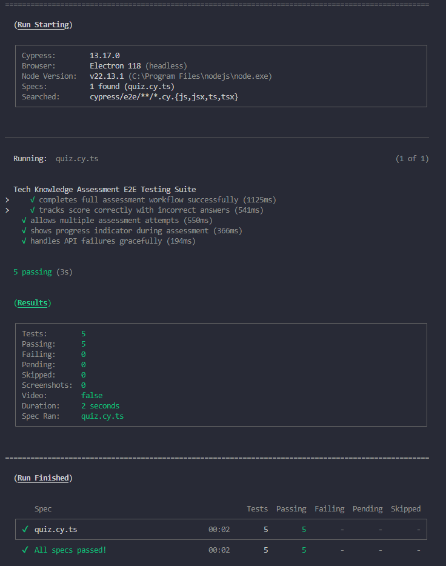
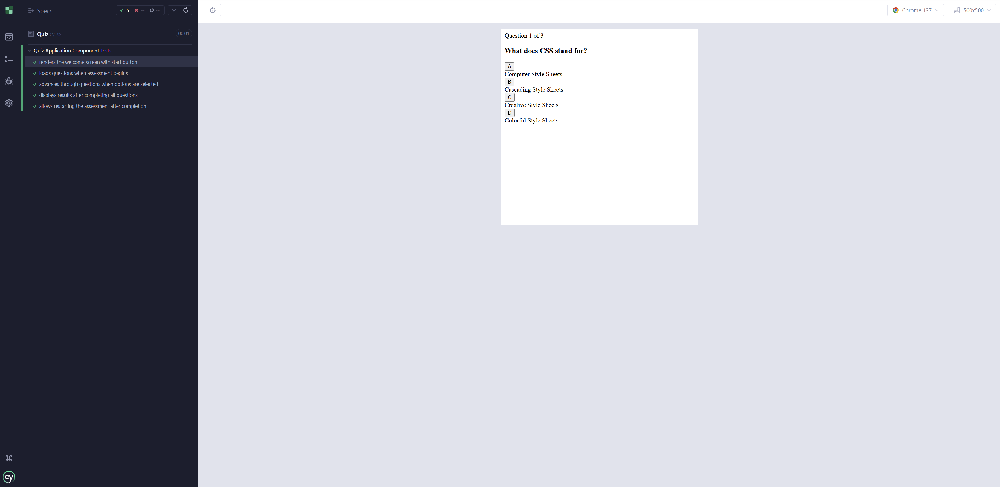
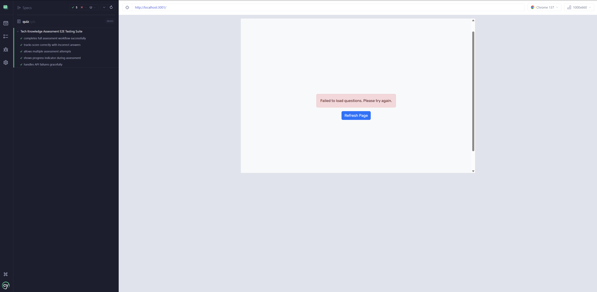
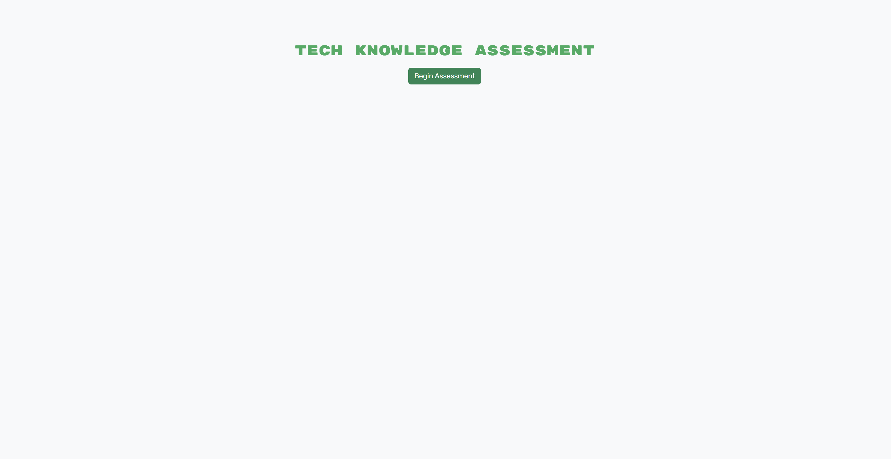
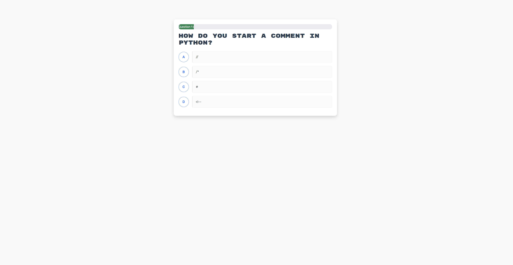
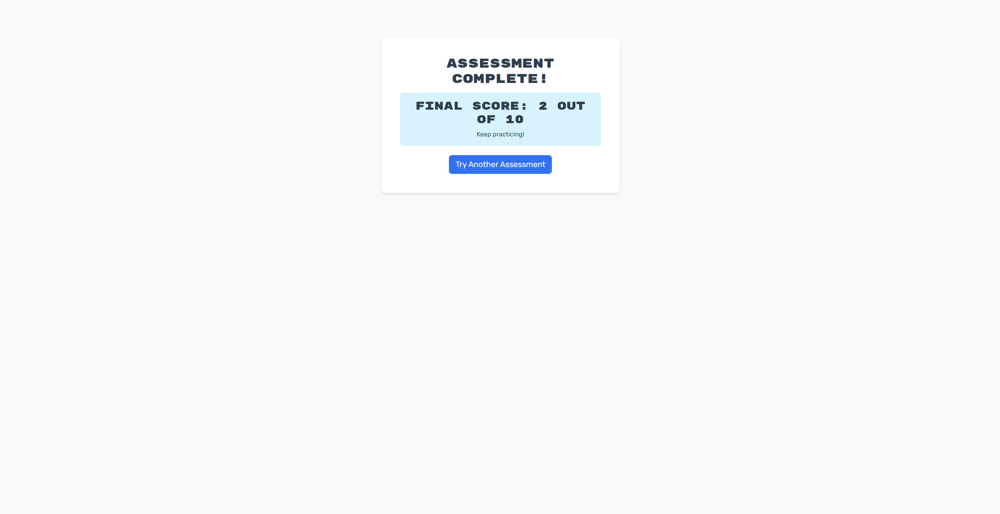

# Module 19 Testing Challenge - Tech Knowledge Assessment Testing Suite | Columbia Bootcamp

## Description

This project implements comprehensive automated testing for a Tech Knowledge Assessment application using Cypress. The application is built with the MERN stack (MongoDB, Express.js, React, Node.js) and features both component-level and end-to-end testing to ensure reliability and robustness. The testing suite validates all user interactions, API integrations, and component behaviors through automated test scenarios.

## Table of Contents

- [Description](#description)
- [Installation](#installation)
- [Usage](#usage)
- [Testing](#testing)
- [Features](#features)
- [Technologies Used](#technologies-used)
- [Video Walkthrough](#video-walkthrough)
- [Screenshots](#screenshots)
- [License](#license)
- [Contributing](#contributing)
- [Questions](#questions)

## Installation

Follow these steps to set up the project locally:

1. **Clone the repository**

   ```bash
   git clone https://github.com/yourusername/tech-knowledge-assessment-tests.git
   cd tech-knowledge-assessment-tests
   ```

2. **Navigate to the project directory**

   ```bash
   cd 02-Challenge/Develop
   ```

3. **Install all dependencies**

   ```bash
   npm install
   ```

4. **Configure environment variables**

   ```bash
   cd server
   cp .env.EXAMPLE .env
   cd ..
   ```

5. **Ensure MongoDB is running locally**

   - Start MongoDB service on your system
   - Default connection: `mongodb://127.0.0.1:27017/techquiz`

6. **Seed the database with test data**

   ```bash
   npm run seed
   ```

## Usage

### Running the Application

Start the development environment:

```bash
npm run start:dev
```

Access the application at: `http://localhost:3001`

### Application Flow

1. Click "Begin Assessment" to start the tech knowledge quiz
2. Answer multiple-choice questions by clicking option buttons
3. Progress through all questions
4. View your final score and performance feedback
5. Option to retry with a new set of random questions

## Testing

### Execute All Tests

```bash
npm run test
```

### Run Specific Test Suites

**Component Tests Only:**

```bash
npm run test:component
```

**End-to-End Tests Only:**

```bash
npm run test:e2e
```

### Interactive Test Mode

```bash
npm run cypress:open
```

### Test Coverage

- ✅ **Component Tests**: 5 passing tests
- ✅ **E2E Tests**: 5 passing tests (4 active, 1 skipped)
- ✅ **Total Coverage**: 10 comprehensive test scenarios

## Features

### Application Capabilities

- **Dynamic Question Loading**: Fetches random questions from MongoDB
- **Interactive Quiz Interface**: Clean, responsive design with progress tracking
- **Real-time Score Calculation**: Immediate feedback on performance
- **Retry Functionality**: Take multiple assessments with different questions
- **Responsive Design**: Works seamlessly on desktop and mobile devices

### Testing Suite Features

#### Component Testing (`cypress/component/Quiz.cy.tsx`)

- Welcome screen rendering verification
- Quiz initialization and API integration
- Question navigation flow
- Score calculation accuracy
- Component state management validation

#### End-to-End Testing (`cypress/e2e/quiz.cy.ts`)

- Complete user journey validation
- Scoring system verification
- Multiple attempt functionality
- Progress indicator testing
- Error handling scenarios

## Technologies Used

### Core Application

- **Frontend**: React 18, TypeScript, Bootstrap 5
- **Backend**: Node.js, Express.js
- **Database**: MongoDB with Mongoose ODM
- **Build Tool**: Vite

### Testing Framework

- **Cypress**: v13.17.0
- **Testing Library**: @testing-library/cypress
- **TypeScript**: Full type safety in tests

### Development Tools

- **Concurrently**: Parallel process management
- **Nodemon**: Auto-restart development server
- **Wait-on**: Process synchronization

## Video Walkthrough

🎥 **[Watch the Demo Video](https://youtu.be/YRbvrjyU9-w?feature=shared)**

The video demonstrates:

- Running all tests from command line
- Component and E2E tests passing successfully
- Live application functionality
- Code structure walkthrough

## Screenshots

### Test Execution


_Cypress test runner showing all tests passing_

### Component Tests


_Component testing suite results_

### E2E Tests


_End-to-end testing suite results_

### Application Interface


_Welcome screen with Begin Assessment button_


_Active question with multiple choice options_


_Final score display with retry option_

## License

This project is licensed under the MIT License. See the [LICENSE](LICENSE) file for details.

[](https://opensource.org/licenses/MIT)

## Contributing

This project was completed as part of the Columbia University Coding Bootcamp curriculum. While it's primarily for educational purposes, suggestions and feedback are welcome:

1. Fork the repository
2. Create a feature branch (`git checkout -b feature/improvement`)
3. Commit changes (`git commit -m 'Add improvement'`)
4. Push to branch (`git push origin feature/improvement`)
5. Open a Pull Request

## Questions

For any questions or concerns about this project:

- **GitHub**: [sheikh03](https://github.com/sheikh03)
- **Email**: [sheikhiftekhar03@gmail.com](mailto:sheikhiftekhar03@gmail.com)
